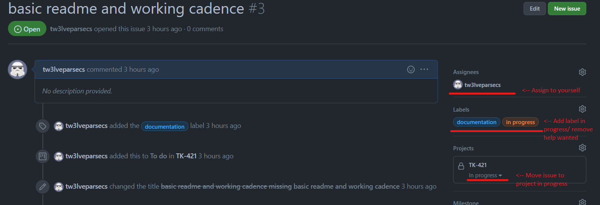
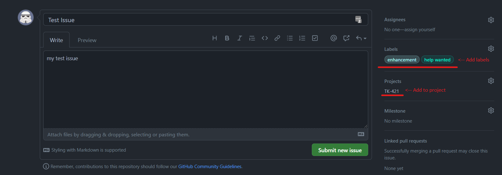

# Project TK-421
Project code named TK-421 purpose is to develop an opinionated deployment of AKS with a secure baseline using GitHub Actions and Bicep.

Microsoft [AKS Secure Baseline](https://github.com/mspnp/aks-secure-baseline) will largely be utilised as a starting point and built upon with improvements and opinionated implementations. 

## Working Cadence 

### Project Tracking
GitHub Issues are used to track tasks for the project.

All issues with the **help wanted** are available for any team member to work on. 

#### Picking up a task
1. **Open** the GitHub issue
2. **Assign** it to yourself
3. Add label **in progress**
4. Remove label **help wanted**
5. **Move** issue to project's in progress

#### Creating a task
1. Create new GitHub Issue with the required details
2. Add appropriate labels, e.g. help wanted, enhancement, documentation etc.
3. Add issue to project TK-421
4. Submit new issue

### Branching
When working on new code create a new feature branch and work directly from there. 
When ready to merge create a PR into the develop branch and it will be automatically assigned to code owners for review.

Code will be deployed/tested from develop branch and when finalised and merged into main.